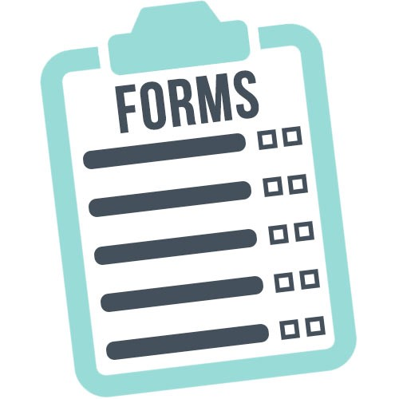

# Re - Former

> Bare Metal Forms and Helpers.

    

The porpuse of this project is  build a form the old fashioned way and then the Rails way.

## Built With

- Ruby on Rails 5.2.4

## Authors

👤 **Ivan Ulises Guzman Sanchez**

- Github: [@fivan18](https://github.com/fivan18)
- Twitter: [@fivanunam](https://twitter.com/fivanunam)
- Linkedin: [fivan](https://www.linkedin.com/in/fivan)

👤 **Remy Certil**

- Github: [@certilremy](https://github.com/certilremy)
- Twitter: [@certilremy](https://twitter.com/certilremy)
- Linkedin: [certilremy](https://linkedin.com/in/certilremy)

## 🤝 Contributing

Contributions, issues and feature requests are welcome!

Feel free to check the [issues page](https://github.com/fivan18/re-former/issues).

## 📝 License

This project is [MIT]() licensed.
